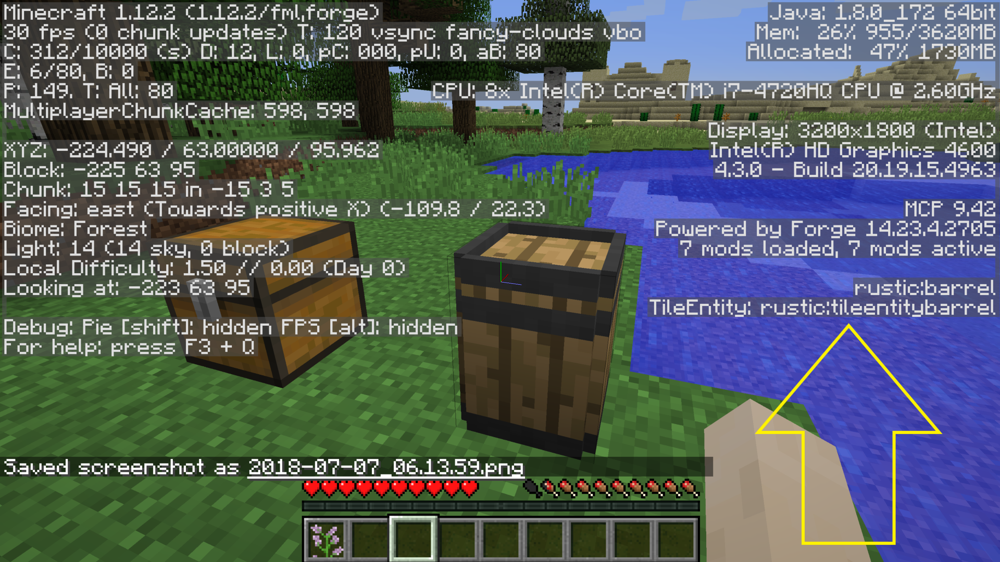
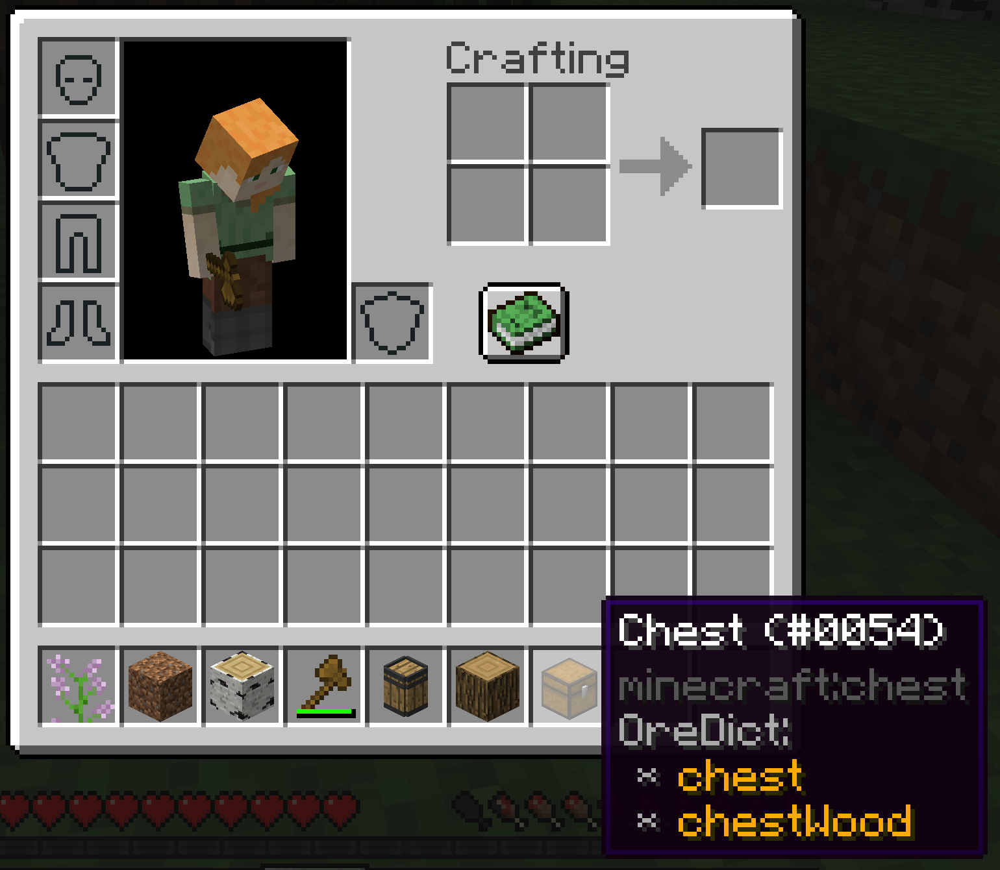

# Daring Debug

Do you DARE to see extra debug information in Minecraft?

Intended audiences are mod developers, mod pack authors, and users needing to debug a problem.  Due to CPU expense, running this mod during normal gameplay is NOT recommended.

This mod adds:

### 1.14.4
 * a TileEntity-under-cursor entry to debug screen.
 * a tag list for ItemStacks to advanced tooltips
 * (default off due to expense) capability displays for TileEntity, Entity, Chunk, and World (via debug screen), and for ItemStack (via tooltips)

### 1.12.2
 * a TileEntity-under-cursor entry to debug screen.
 * an oreDict list for ItemStacks to advanced tooltips and debug screen
 * (default off due to expense) capability displays for TileEntity, Entity, Chunk, and World (via debug screen), and for ItemStack (via tooltips)

This display is useful for debugging and configuration of mods that need TileEntity registration names, like [Food Funk](https://github.com/Stormwind99/FoodFunk).  By looking at a block with the debug screen active, if the block has a TileEntity attached it will display the Forge registration name of that TileEntity with the prefix "TileEntity:" under the block name.  You can then use this name in configuration files for other mods which require TileEntity registration names.

## Screenshots

TileEntity on debug screen (1.12.2)

oreDict entries on advanced tooltip for an item (1.12.2)
